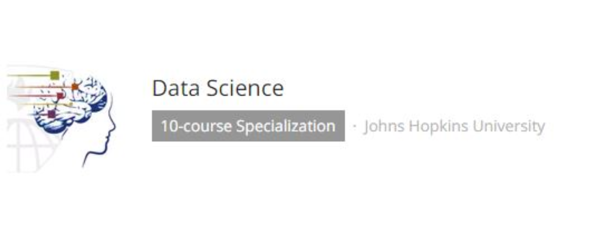
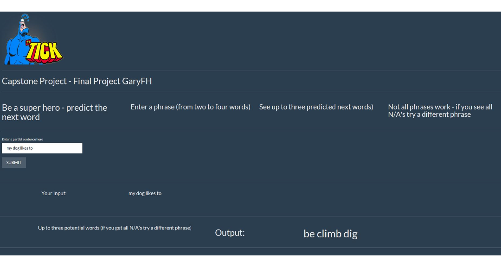

Capstone Project Final Project Presentation
========================================================
author: GaryFH
date: 10/27/2017
#autosize: true

Data Science Capstone
by Johns Hopkins University

========================================================
INTRODUCTION   

- The purpose of this application is to allow a user to input a phrase and it would predict the next word that they “most likely” want to type.

- The n-grams that support the application come from blogs,  twits and news.

- One possible use could be for texting

- Milestone Report Link : [Milestone Report](https://rpubs.com/GaryFH/320044)

- Application link : [Shiny App - Next Word Prediction](https://garyfh.shinyapps.io/CapstoneProject_FinalProject/)

- Github Link : [Codes](https://github.com/GaryFH/Capstone-Project)

========================================================

TEXT PREDICTION ALGORITHM STEPS TAKEN

- Downloading data from course materials.
- Clean up text (remove badwords, remove whitespace,  remove symbols/numbers/non english words,  make all letters lowercase, etc.)
- Combined all types of data into one dataset
- Data too big to work with so I took a sample (40,000 lines)
- Tokenization
- Make N-grams (bigrams, trigrams and fourgrams) from the data (this step took over 1 hour of processing time)
- Develop a prediction algorithm that uses the saved ngrams to predict the next word
- input to be a phrase from two to four words and the output to be up to three potential next words
- tests show that for about 30% of the phrases no predictions were found - show N/A for these cases

========================================================

- Instructions
     - **Wait 10 seconds** for the app to load
     - Input phrase
     - Top 3 most probable next words are displayed - **this can take from 5 to 30 seconds**
     - tests show that for 30% of inputs no predictions were found - show N/A for these cases

========================================================

Conclusion

- Excerpt from course outline:

"We have compiled some basic natural language processing resources below. You are welcome to use these resources or any others you can find while performing this analysis. One thing to keep in mind is that we do not expect you to become a world's expert in natural language processing. The point of this capstone is for you to show you can explore a new data type, quickly get up to speed on a new application, and implement a useful model in a reasonable period of time.""

**Limitations**
 - my computer only has 6GB of ram - it runs slow
 - A sample representative population of about 1-2% was used to creat the ngrams
 - tests show that for about 30% of the phrases no predictions were found - show N/A for these cases
